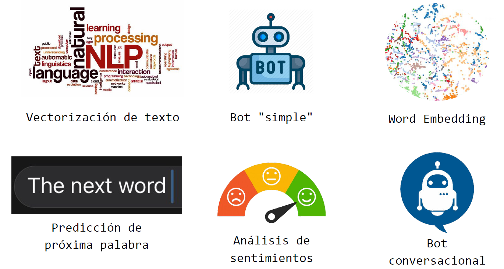

 
Autor: Lionel Gutiérrez - 2022

#  Procesamiento del Lenguaje natural
Repositorio para los ejercicios de la materia procesamiento de lenguaje natural, de la Especialización en IA (CEIA) de la FIUBA. 3er bimestre 2022

---

## Contenido

A continuación se listan los temas tratados y los desafios semanales planteados en la materia, junto con una breve descripción de cada objetivo.

--------------------

### [Desafío 1](Desafio%201/Desafio_1.ipynb)

Los temas tratados durante la primer semana fueron:

* Introducción a NLP (natural language programing)
* Vectorización de documentos

El objetivo del primer desafio fue realizar la vectorizacion de un texto, utilizando OneHotEncoding, vectores de frecuencia y TF-IDF.

### [Desafío 2](Desafio%202/Desafio_2.ipynb)

Los temas tratados durante la segunda semana fueron:

* Preprocesamiento de texto
    * Tokenización de documentos
    * Lemmatization
    * Stop words
* Librerías de NLP 
* Rule-Based Bots

El objetivo del segundo desafio fue realizar un bot basado en reglas utilizando la libreria Spacy y cetores TF-IDF.

### [Desafío 3](Desafio%203/Desafio_3.ipynb)

Los temas tratados durante la tercer semana fueron:

* Word Embeddings
* CBOW y SkipGRAM
* Generación de embeddings con Gensim

El objetivo del tercer desafio fue utilizar documentos / corpus para crear embeddings de palabras basado en ese contexto utilizando tanto el método de CBOW como el de Skipgram. Se tomo como base para generar los embeddings un conjnuto de artículos deportivos de la BBC.

### [Desafío 4](Desafio%204/Desafio_4.ipynb)

Los temas tratados durante la cuarta semana fueron:

* Redes neuronales recurrentes (RNN)
* Problemas de secuencia
* Estimación de próxima palabra

El objetivo del cuarto desafio fue realizar una predicción de próxima palabra utilizando RNN y LSTM. Se tomó como base el libro del Hobbit para generar el corpus y los embeddings. Luego se utilizaron esos embeddings junto con layers LSTM para predeccir la próxima posible palabra.

### [Desafío 5](Desafio%205/Desafio_5.ipynb)

Los temas tratados durante la quinta semana fueron:

* Redes LSTM
* Análisis de sentimientos

El objetivo del quinto desafio fue Utilizar Embeddings +
LSTM para clasificar críticas de compradores de ropa (problema de análisis de sentimientos).

Utilizando un dataset de criticas de compradores de ropa se entrenaron modelos con redes LSTM tanto con embeddings pre-entrenados como con embeddings entrenados en la misma red.

Para este desafio se desarrollaron 2 jupyter notebboks separadas, dado que el dataset tenía clases desbalanceadas. Se implementó un modelo base y un modelo con oversampling de los datos, viendo mejoras en los resultados finales en este último.

* #### [Desafío 5 base](Desafio%205/Desafio_5.ipynb)
* #### [Desafío 5 con oversampling](Desafio%205/Desafio_5_oversampling.ipynb)

### [Desafío 6](Desafio%206/Desafio_6.ipynb)

Los temas tratados durante la sexta semana fueron:

* Modelos Seq2Seq
* Traductores
* Bots conversacionales

El objetivo del sexto desafio fue Utilizar redes LSTM encoder - decoder para construir un bot conversacional.

## Profesores de la materia
* Esp. Ing. Hernán Contigiani
* Msc. Rodrigo Cardenas Szigety

## Autor e información de contacto
* Lionel Gutiérrez

&nbsp;&nbsp;&nbsp;&nbsp;&nbsp;&nbsp;&nbsp;

