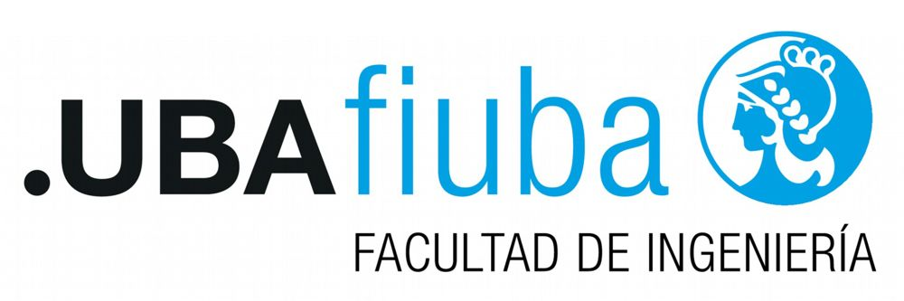

 
Autor: Lionel Gutiérrez - 2022

#  Procesamiento del Lenguaje natural
Repositorio para los ejercicios de la materia procesamiento de lenguaje natural, de la Especialización en IA (CEIA) de la FIUBA. 3er bimestre 2022

---

## Contenido

### [Desafío 1](Desafio%201/Desafio_1.ipynb)

### [Desafío 2](Desafio%202/Desafio_2.ipynb)

### [Desafío 3](Desafio%203/Desafio_3.ipynb)

### [Desafío 4](Desafio%204/Desafio_4.ipynb)

### [Desafío 5](Desafio%205/Desafio_5.ipynb)

## Profesores
* Esp. Ing. Hernán Contigiani
* Msc. Rodrigo Cardenas Szigety

## Autor
Lionel Gutiérrez

&nbsp;&nbsp;

